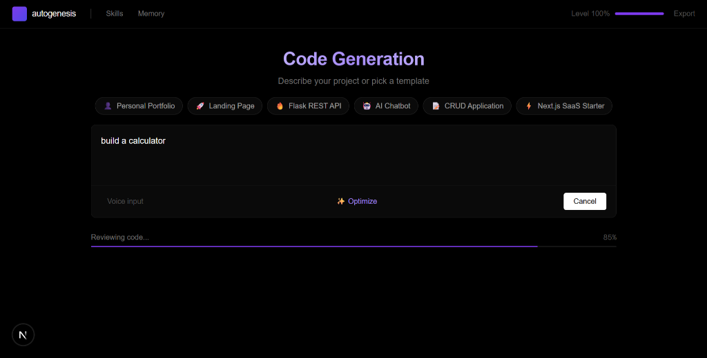
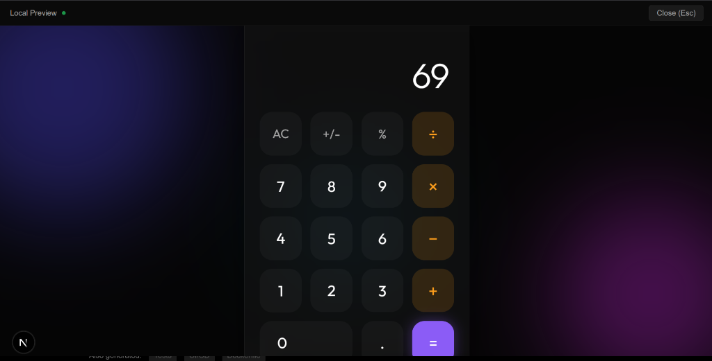
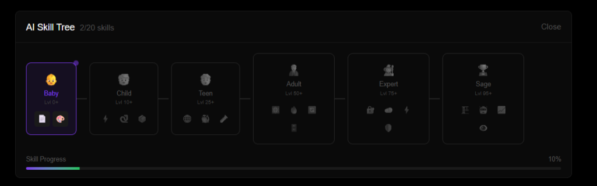
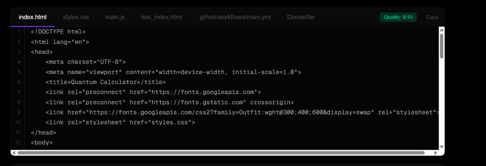

# Autogenesis 🧬

**The Self-Evolving AI Developer**

[](https://opensource.org/licenses/MIT)
[]()
[]()
[]()

> *Typical coding assistants reset every session. Autogenesis remembers, learns, and grows with you.*

***



## 🔮 What is Autogenesis?

Autogenesis is an autonomous software engineer that lives in your browser.  
It doesn't just autocomplete code; it **plans, architects, builds, tests, and deploys** full-stack applications from a single prompt.

But the real magic is in its **growth mechanics**:

- **Memory**: It remembers every project you've built.  
- **XP System**: Every feature you implement earns XP.  
- **Skill Tree**: As it levels up, it unlocks new capabilities (e.g., Python Lv1 -> Python Lv5).  
- **RLHF Training**: Rate its code (1–5 stars) to train a custom model adapter via **Oumi**.

***

## ✨ Features at a Glance

| Feature | Description | Tech Provider |
| :--- | :--- | :--- |
| **⚡ Instant Builds** | Generates full-stack apps in seconds using LPUs. | **Groq** |
| **🧠 Deep Logic** | Handles complex architecture & reasoning. | **Gemini 2.0** |
| **💾 Long-Term Memory** | Tracks project history & evolution. | **Kestra** |
| **🎯 Self-Correction** | Auto-fixes bugs & dependency errors. | **CodeRabbit** |
| **🚀 Instant Deploy** | One-click public hosting. | **Vercel** |
| **🎓 Adaptive Learning** | Learns from your feedback ratings. | **Oumi** |

***

## 📸 Visual Tour

### Live Preview & Editing
*Watch code turn into reality instantly with full-screen previews.*


### The AI Skill Tree
*Watch your agent evolve from "Baby" to "Sage" as you build more app.*


### Production-Ready Code
*Clean, well-structured code with automated error checking.*


***

## 🚀 Quick Start

### 1. Requirements

- Node.js 18+  
- Python 3.9+

### 2. Backend (FastAPI)

```bash
cd backend
python -m venv .venv
source .venv/bin/activate
pip install -r requirements.txt
cp .env.example .env  # Add your GROQ_API_KEY
python -m uvicorn api:app --reload
```

### 3. Frontend (Next.js)

```bash
cd frontend
npm install
npm run dev
```

Visit `http://localhost:3000` and start building!

***

## 🛠️ Architecture & Tech Stack

Autogenesis uses a multi-agent system to simulate a real dev team:

1. **The Architect** (Gemini): Plans the project structure.  
2. **The Coder** (Groq): Writes high-speed code logic.  
3. **The Reviewer** (CodeRabbit): Checks for bugs and security.  
4. **The DevOps** (Vercel): Handles deployment pipelines.

Autogenesis is built on a hybrid multi-model architecture that combines ultra-fast inference, high-context reasoning, orchestration, RL training, and automated CI/CD.

***

### 🤖 AI & Reasoning Layer

| Technology | Purpose |
| :--- | :--- |
| **Groq LLaMA‑3.1 / 3.3 70B** | Primary coding engine for multi-file generation, architecture, and debugging. |
| **Gemini 2.0 Flash** | High-context planner and fallback reasoning model for complex workflows. |
| **Oumi (RLHF + DPO)** | Learns from user ratings and optimizes code generation preferences. |
| **CodeRabbit** | Automated PR reviews, security scanning, and code quality enforcement. |
| **Cline AI CLI** | Autonomous command execution, dev automation, and simulated agent workflow. |

***

### ⚙️ Backend (AI Orchestration Layer)

| Technology | Purpose |
| :--- | :--- |
| **FastAPI** | Backend API for orchestrating agents and tools. |
| **Uvicorn** | ASGI server enabling low-latency streaming responses. |
| **Server-Sent Events (SSE)** | Real-time event, log, and file streaming to the UI. |
| **Python 3.9+** | Primary backend language and orchestration logic. |
| **Pydantic** | Request/response validation and type-safe schemas. |
| **Docker** | Containerization for reproducible backend deployments. |
| **python-dotenv** | Environment variable and secret management. |

***

### 🧩 Internal Agent Modules

| Module | Functionality |
| :--- | :--- |
| **Architect Agent** | Plans folder structures, system architecture, and task breakdown. |
| **Coder Agent** | Generates code file-by-file across frontend and backend. |
| **Reviewer Agent** | Detects issues, suggests fixes, and enforces quality gates. |
| **Memory Engine** | Stores project history, XP, and skill progression. |
| **Intelligence Engine** | Implements levels, XP, and skill evolution logic. |
| **Oumi RL Engine** | Produces and consumes feedback data for preference optimization. |

***

### 🎨 Frontend (UI + Experience Layer)

| Technology | Purpose |
| :--- | :--- |
| **Next.js 14/15** | React meta-framework for the Autogenesis web app. |
| **TypeScript** | Type-safe frontend development and API contracts. |
| **Tailwind CSS** | Utility-first styling for rapid UI iteration. |
| **Framer Motion** | Animations and micro-interactions for the dashboard and previews. |
| **Web Speech API** | Voice-to-text prompts for hands-free tasking. |
| **React Hooks + Context** | Client-side state and session management. |

***

### ☁️ DevOps & Deployment

| Technology | Role |
| :--- | :--- |
| **Vercel** | One-click deployment for the frontend experience. |
| **GitHub Actions** | Automated CI/CD pipelines and checks on every push/PR. |
| **Kestra** | Long-term memory summarization, workflows, and scheduling. |
| **Dockerfile Generator** | Generates production-ready Docker builds for services. |

***

### 📦 Tooling & Developer Experience

| Tool | Purpose |
| :--- | :--- |
| **pnpm / npm** | Frontend dependency and script management. |
| **ESLint + Prettier** | Optional linting and auto-formatting of the codebase. |
| **Vitest / Pytest** | Auto-generated unit testing for frontend and backend. |
| **GitHub Codespaces** | Cloud-based development environment support. |

***

### 📚 Data & Storage

| Technology | Purpose |
| :--- | :--- |
| **JSON Memory Store** | Persistent agent memory for sessions, XP, and history. |
| **Kestra Buckets** | Workflow state, logs, and artifact storage. |
| **In-memory caching** | Latency reduction for hot paths and repeated queries. |

***

## 🤝 Community

Built for the **2025 AI Hackathon**.

- **Groq** for speed.  
- **Gemini** for intelligence.  
- **Kestra** for orchestration.  
- **Oumi** for training.

***

Built with 🫶 by Nikhil Jones A & SH Nihil Mukkesh

© 2025 Autogenesis Team. Open Source. Licensed under the MIT License.[3]